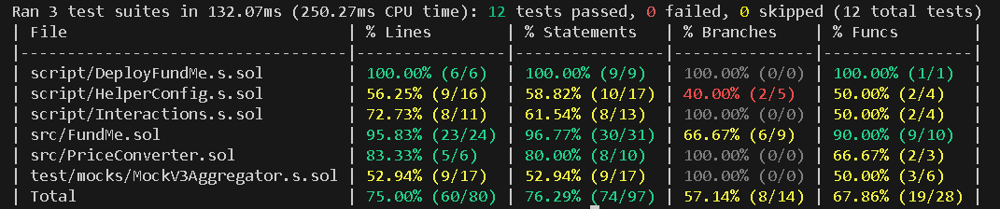

# FundMe smart contract

The `FundMe` smart contract enables users to deposit funds in Wei, with the requirement that the amount must exceed a specified `MINIMUM_USD` value in USD. This project leverages [Chainlink Data Feeds](https://data.chain.link/) to convert the deposited Wei into its equivalent USD value. Subsequently, the contract owner has the ability to withdraw these funds.

### Requirements

- `FundMe` contract use a Foundry framework. [Install foundry](https://getfoundry.sh/)

### Work with project

1. Clone git repo and build project

```bash
git clone https://github.com/shashankTwr/foundry-fundme.git
cd foundry-fund-me
forge build
```

2. Install the dependencies

```bash
make install
```

This project relies on the following dependencies:

- [chainlink-brownie-contracts](https://github.com/smartcontractkit/chainlink-brownie-contracts) for interacting with Chainlink Price Feeds.
- [foundry-devops](https://github.com/cyfrin/foundry-devops) for creating interaction scripts with the contract as well as ensuring the smart contract works on vanilla EVM chain as well as zkSync.

To utilize `foundry-devops`, you may need to install `jq`, a lightweight and flexible command-line JSON processor. You can install `jq` using `sudo apt-get install jq` (for Debian) or verify its installation by running `jq --version`. Additionally, ensure the `ffi = true` setting is enabled in the `foundry.toml` file for the tool to function correctly.

3. To deploy and interact with the contract, create your `.env` file; an example is provided in the repository. Than utilize a `Makefile` .

```bash
# default: deploy to anvil chain
# run below command in separate terminal
anvil
make deploy


# to interact with contract in a specific network
make fund
make withdraw
```

4. To run tests use the following command:

```bash
forge test
```

To view the test coverage, utilize the following command:

```bash
forge coverage
```



This project was created and finalized while completing a free course of [Cyfrin Updraft](https://youtu.be/-1GB6m39-rM?si=3Q6TWV9xOYsgS65T) on YouTube.
